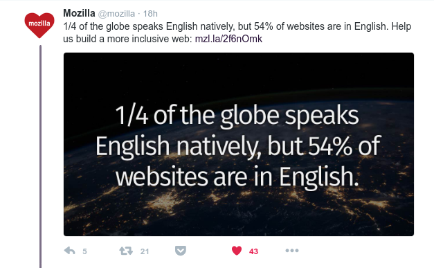
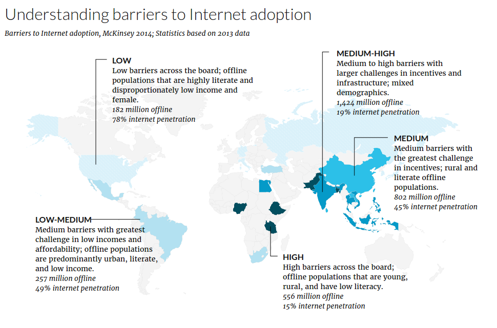
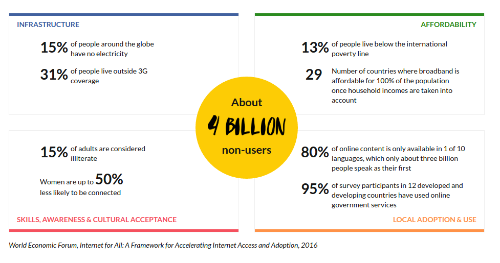
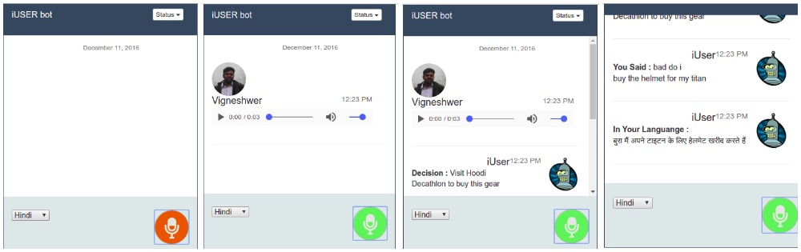
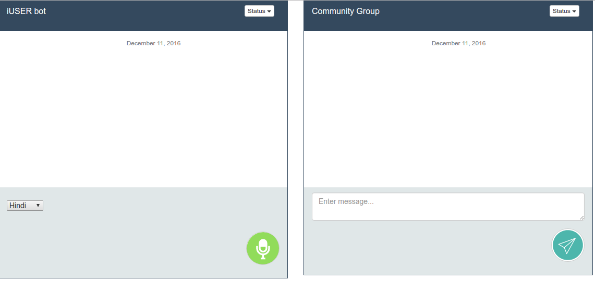

# iUsers
An interactive AI bot which understands user language and provides voice commands along with localized contents for participating in the web

## Problem Statement
How to get 4 billion non internet users across the globe to become participants of the open web ?

## Key Solution

AI based conversational bot which bridges the language gap between people in community and promotes diversity & inclusion behaviour

## Current Situation

Based on the stats we can say that, 

> > Technology needs to better design its products & service with an human centric view for audience who are not included in the present ecosystem

## Desired State
Products and business models, which has behaviours and features for non-users to adopt & become literate web participants

## Unique Functionality & feature
	
* Voice / Language Recognition (AI Classifier)
* Localization of site.platform to the corresponding Language (Converter)
* Product/Service use showcase with voice commands (Intelligent Navigator)

## B-model

* Open Source Project for all websites to train their iUser
* Pay as you go to use Trained models via api
* Get paid for Open data submissions to platform

## User Research 

* [Solving the problem of connecting the unconnected](https://dvigneshwer.wordpress.com/2016/11/26/solving-the-problem-of-connecting-rural-women/)
* [Solutions for the problems in Diversity & Inclusion](https://dvigneshwer.wordpress.com/2016/11/24/solutions-for-the-problems-in-diversity-inclusion/)

## Architecture - Prototype 1 

* UI : The User interface of the chat bot has a record audio button. As soon as a recording is made a request is sent to the backend which triggers a web service to translate speech to text and ML algorithms
* Backend : It's Flask webserver running, containing trained models and translation apis

## iUser Deployment

* Dependencies
~~~~
pip install google-cloud-translate
pip install flask
pip install scikit-learn
~~~~

* Start Flask Web server
~~~~
python web_server.py
~~~~

* REST API's
~~~~
curl -H "Content-type: application/json" -X POST http://127.0.0.1:5000/process_data -d '{"audio_location":"./lang_data/english/english_sample.wav"}'
~~~~

## Prototype Web User interface

Worflow:

* Bot records speech
* Sends data to web services
* Populates trained community response
* Converts it to native language

To promote diversity and inclusive nature in the groups, we trained the model on community to generate apt recommendations. 

The native language converter helps in interaction between people from different backgrounds and cultures.

## Team Members

We are a team of thinkers, coders and philanthropist making the web smarter, safe and inclusive :)

* [Vigneshwer (Project Lead)](https://twitter.com/dvigneshwer)
* [Abhijay](https://twitter.com/jay_ghildi)
* [Vinod](https://twitter.com/vkrishna143)

**[Pitch Deck](https://goo.gl/GhjWLi)**
