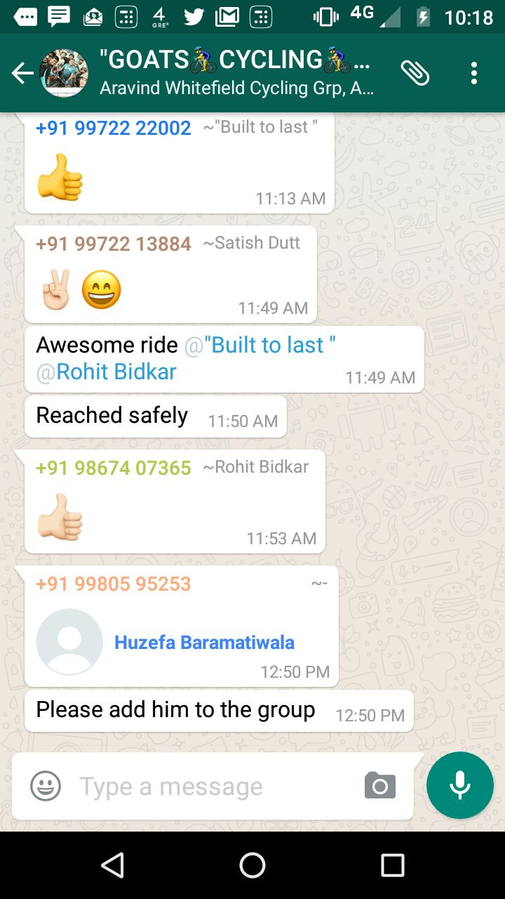

# Community Specific Data Training

Support Vector Machine (SVM) model is trained on the whatsapp data of an active cycling group in Bengaluru, known as Go out and tour somewhere (GOATS). This is implemented to classify the users chat and help answers some of his queries.

# GOATS Whatsapp Group

This community's chat data was used for training

